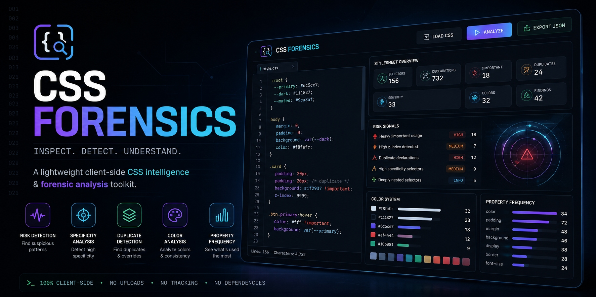
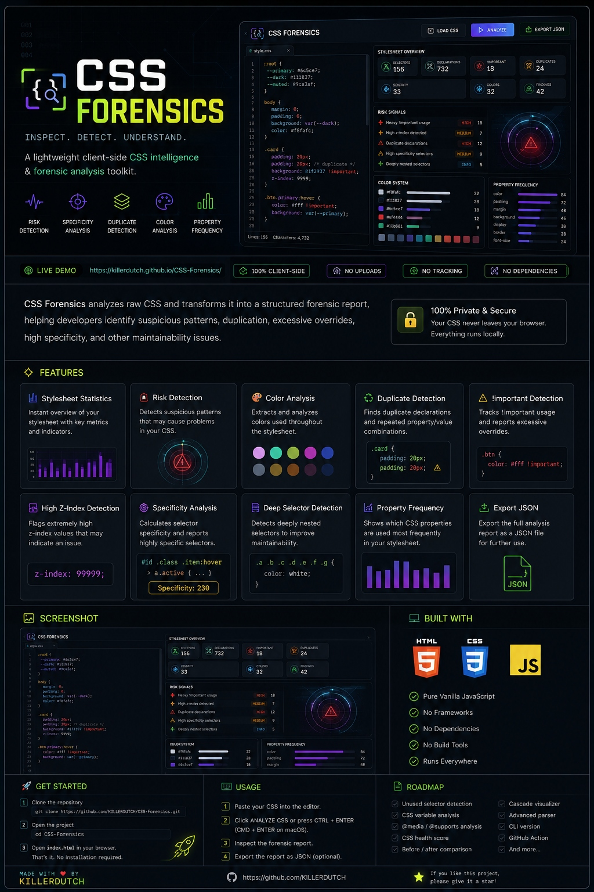

 CSS FORENSICS

Inspect. Detect. Understand.

A lightweight client-side CSS intelligence & forensic analysis toolkit.

   

&nbsp;

&nbsp;

&nbsp;
  

---

About

CSS Forensics analyzes raw CSS and transforms it into a structured forensic report.

Instead of simply checking whether CSS is valid, it investigates patterns that may make a stylesheet harder to maintain, understand, debug, and scale.

It focuses on questions such as:

«Where are the suspicious patterns?»

«Which selectors deserve attention?»

«Where is the cascade becoming unnecessarily complex?»

«How consistent is the stylesheet?»

The entire application runs directly in the browser using HTML, CSS, and Vanilla JavaScript.

---

Live Demo

  

Paste CSS → Analyze → Investigate → Export

---

Preview

---

Features

Stylesheet Statistics

CSS Forensics provides an instant overview of the analyzed stylesheet.

- Total selectors
- Total declarations
- "!important" usage
- Duplicate declarations
- Unique colors
- Property frequency
- Total findings

Forensic Risk Detection

The analyzer searches for patterns that may indicate maintainability problems.

Current detections include:

- Excessive "!important"
- Duplicate declarations
- Repeated property/value combinations
- High "z-index" values
- High selector specificity
- Deep selectors
- Large color systems
- Repeated CSS values

Finding Severity

Level| Meaning
HIGH| Potentially problematic pattern
MEDIUM| Worth reviewing
INFO| Informational observation

---

Color Analysis

CSS Forensics extracts colors from the stylesheet and calculates their frequency.

Supported formats include:

- HEX
- RGB
- RGBA
- HSL
- HSLA
- Named colors
- "transparent"

Example:

COLOR SYSTEM

#ffffff  ███████████████████  17
#111111  ███████████          10
#6c5ce7  ██████                6
#ff4757  ███                   3

This can help identify fragmented or unnecessarily large color systems.

---

Property Frequency

The analyzer calculates which CSS properties appear most frequently.

PROPERTY FREQUENCY

color        █████████████████  18
padding      ███████████        12
margin       █████████           9
background   ███████             7
display      █████               5

This provides a quick overview of stylesheet structure and patterns.

---

Duplicate Detection

CSS Forensics detects duplicate declarations inside CSS rules and repeated property/value combinations.

Example:

.card {
    padding: 20px;
    padding: 20px;
}

The analyzer can report:

HIGH

Duplicate padding: 20px

Same declaration appears twice in one rule.

---

"!important" Detection

"!important" is not automatically a problem, but excessive usage can make the cascade harder to understand and maintain.

Example:

.button {
    color: white !important;
}

.modal {
    z-index: 9999 !important;
}

CSS Forensics tracks these occurrences and reports them as forensic findings.

---

High "z-index" Detection

Extremely large "z-index" values can indicate an uncontrolled stacking system.

Example:

.modal {
    z-index: 99999;
}

The analyzer flags unusually high values for review.

---

Specificity Analysis

CSS Forensics calculates selector specificity and identifies selectors that may become difficult to override.

Example:

#app .page .content .sidebar .menu a.active {
    color: red;
}

High-specificity selectors can become a source of unnecessary cascade complexity.

---

Deep Selector Detection

Deeply nested selectors can increase coupling and make CSS harder to maintain.

Example:

.page .content .sidebar .menu ul li a span {
    color: white;
}

CSS Forensics detects excessive selector depth and reports it for review.

---

How It Works

The analysis pipeline is intentionally lightweight.

CSS Input
    |
    v
Comment Removal
    |
    v
Rule Extraction
    |
    v
Declaration Parsing
    |
    +-------------------+
    |                   |
    v                   v
Property Analysis   Color Detection
    |                   |
    v                   v
Duplicate Scan     Color Frequency
    |                   |
    +---------+---------+
              |
              v
      Specificity Analysis
              |
              v
       Selector Analysis
              |
              v
        Risk Detection
              |
              v
       Report Generation
              |
              v
      Interactive Dashboard

Everything is processed locally inside the browser.

---

Privacy

CSS Forensics is a 100% client-side application.

Your stylesheet is processed locally by JavaScript.

YOUR CSS
   |
   v
YOUR BROWSER
   |
   +-- Parser
   +-- Analyzer
   +-- Detector
   +-- Report Generator
   |
   v
FORENSIC REPORT

There is currently:

- No backend
- No database
- No account system
- No CSS upload API
- No analytics dependency
- No external framework

Your CSS does not need to leave your browser.

---

Tech Stack

 Technology| Purpose
HTML5| Application structure
CSS3| Interface and responsive design
Vanilla JavaScript| Parsing, analysis and application logic
DOM APIs| Browser interaction
Blob API| JSON report export

Dependencies

0 npm packages
0 frameworks
0 build tools
0 backend services

---

Getting Started

No Node.js, npm, server, or build process is required.

Clone

git clone https://github.com/KILLERDUTCH/CSS-Forensics.git

Open

cd CSS-Forensics

Open "index.html" in your browser.

No installation is required.

---

Usage

01 — Paste CSS

Paste your stylesheet into the editor.

02 — Analyze

Click:

ANALYZE CSS

Or use:

CTRL + ENTER

On macOS:

CMD + ENTER

03 — Investigate

Review:

- Stylesheet statistics
- Risk signals
- Color usage
- Duplicate declarations
- "!important" usage
- High "z-index"
- Property frequency
- Selector specificity
- Selector depth

04 — Export

Use:

EXPORT JSON

to generate a forensic report.

---

Example

Given:

body {
    color: #ffffff;
    background: #111111;
    z-index: 9999;
}

.card {
    padding: 20px;
    padding: 20px;
    background: #111111 !important;
}

.button {
    color: #ffffff !important;
    z-index: 99999;
}

CSS Forensics can identify:

HIGH
Duplicate padding: 20px

MEDIUM
High z-index: 9999

MEDIUM
High z-index: 99999

MEDIUM
!important used on background

MEDIUM
!important used on color

---

JSON Export

Analysis results can be exported as JSON.

Example structure:

{
  "version": "1.0",
  "selectors": 3,
  "declarations": 8,
  "important": 2,
  "uniqueColors": 2
}

The exported data can serve as a foundation for future automation and integrations.

---

Keyboard Shortcuts

Shortcut| Action
"CTRL + ENTER"| Analyze CSS
"CMD + ENTER"| Analyze CSS on macOS

---

Project Structure

CSS-Forensics/
|
+-- index.html
+-- README.md
|
+-- file_0000000093d881f58565fa92cb6c6dfc.jpg
+-- file_00000000bb68820a8c0416720ccbecee.jpg

The application itself is intentionally contained inside a single HTML file.

"index.html" contains:

- HTML interface
- Complete CSS styling
- JavaScript analyzer
- Detection logic
- Report generator
- JSON exporter

---

Responsive

CSS Forensics adapts to different screen sizes.

Supported layouts include:

- Desktop
- Laptop
- Tablet
- Mobile

The dashboard switches to a more compact layout on smaller screens.

---

Roadmap

Current

- [x] CSS statistics
- [x] Selector counting
- [x] Declaration counting
- [x] "!important" detection
- [x] Duplicate detection
- [x] Repeated declaration detection
- [x] Color extraction
- [x] Color frequency analysis
- [x] Property frequency
- [x] High "z-index" detection
- [x] Specificity analysis
- [x] Deep selector detection
- [x] Risk signals
- [x] JSON export
- [x] Responsive interface

Planned

- [ ] Unused selector detection
- [ ] Duplicate selector detection
- [ ] CSS variable analysis
- [ ] CSS variable recommendations
- [ ] Shorthand property detection
- [ ] "@media" analysis
- [ ] "@supports" analysis
- [ ] "@layer" analysis
- [ ] "@keyframes" analysis
- [ ] CSS health score
- [ ] Before / after comparison
- [ ] Interactive specificity graph
- [ ] CSS cascade visualizer
- [ ] Advanced CSS parser
- [ ] CLI version
- [ ] GitHub Action

---

Limitations

CSS Forensics currently uses a lightweight browser-side parser rather than a complete CSS specification parser.

Because of this, some advanced or unusual CSS syntax may not be interpreted perfectly.

Examples include:

- Complex "@media" structures
- "@supports"
- "@layer"
- Advanced nested CSS
- Unusual syntax
- Highly complex at-rules

A more advanced parsing engine is planned for future versions.

---

Contributing

Contributions, ideas, improvements, and new forensic detectors are welcome.

For new detectors, please include:

- What pattern is being detected
- Why it matters
- Suggested severity
- Example CSS
- Expected analyzer output

---

Issues

Found a bug?

Please open an issue with:

- Browser
- Operating system
- CSS that reproduces the problem
- Expected behavior
- Actual behavior
- Screenshot if useful

Minimal reproducible examples are always appreciated.

---

License

This project is open source.

See the "LICENSE" file for the exact license terms.

---

CSS FORENSICS

Inspect. Detect. Understand.

Built with HTML5, CSS3 & Vanilla JavaScript.

   

Created by KILLERDUTCH

